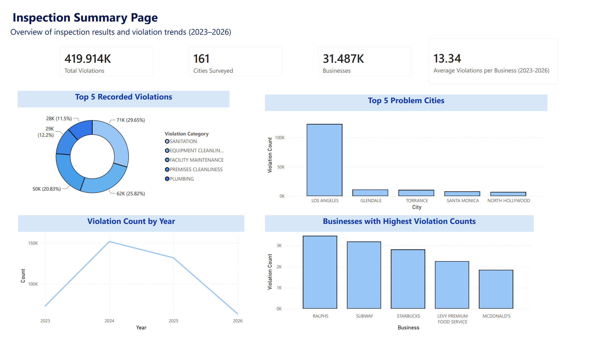
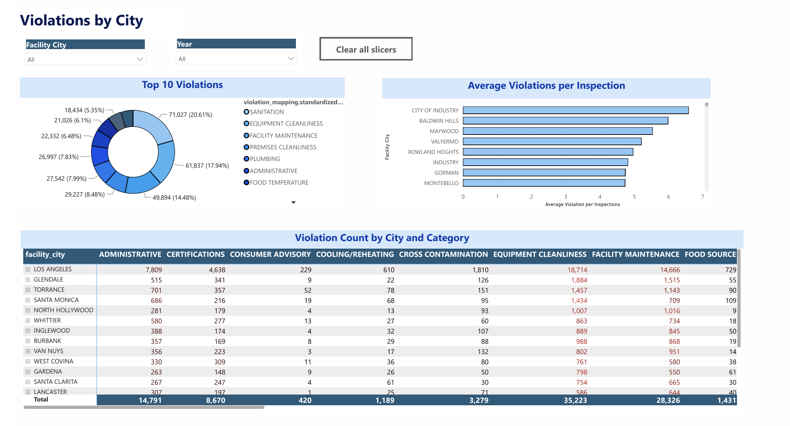

# Environmental Health Inspections Report (Los Angeles County)

An interactive Power BI report analyzing health and safety violations across businesses in Los Angeles County, with detailed breakdowns by year, city, business type, and risk level.

## Table of Contents
- [Overview](#overview)
- [Report Features](#report-features)
- [Data Pipeline](#data-pipeline)
- [How to Use](#how-to-use)
- [Key Metrics](#key-metrics)
- [Requirements](#requirements)

## Overview

This report provides comprehensive insights into violation patterns across Los Angeles County restaurants and markets. It helps identify compliance trends, areas of improvement, and businesses with recurring violations.

- **Data Source**: 
  - Dataset 1: "Environmental Health Restaurant and Market Violations 07/01/2023 to 06/30/2026"
  - Provider: Los Angeles County Department of Public Health
  - URL: https://data.lacounty.gov/datasets/5eaea9f89b7549ee841da7617d3a9cba/about
  - Dataset 2: "Environmental Health Restaurant and Market Inspections 07/01/2023 to 06/30/2026"
  - Provider: Los Angeles County Department of Public Health
  - URL: https://data.lacounty.gov/datasets/19b6607ac82c4512b10811870975dbdc/about
- **Geographic Coverage**: Los Angeles County
- **Time Period**: 07/01/2023-06/30/2026
- **Target Audience**: Health inspectors, business owners, compliance officers, policymakers

## Report Features

### Main Visualizations
- **Violation Counts Overview** - Total violations by year showing trends over time
- **Top 10 Violations** - Which Violation Categories have the highest number of recorded violations
- **Violation Count By Business and Category** - Counts of categorized violations by business
- **Inspection Ratings by Year** - Shows how businesses ratings are distributed across the years
- **Interactive Filters** - Slice and dice by:
  - Year
  - City
  - Business Name
  - Risk Level (High, Medium, Low)

### Key Pages/Tabs
- Overview/Summary
- City Analysis
- Business Trends
- Violations Trend
- Risk Level Analysis

## Data Pipeline

### 1. Data Cleaning (R)
Raw violation and inspection data was cleaned and prepared using R.

**See [`data_cleaning.R`](data_cleaning.R) for the full cleaning process**

**Steps:**
- Loaded raw violation and inspection records
- Handled missing/inconsistent data
- Standardized business names
- Parsed and standardized columns
- Output: Clean datasets (`data/cleaned/violations_cleaned.csv`)

### 2. Pre-Analysis & Aggregation (SQL)
SQL queries were used for data exploration and creating aggregated tables for Power BI.

**See [`sql/`](sql/) directory for all queries**

**Key Queries:**
- `sql/joined_inspections_violations.sql` - joins the two main datasets
- `sql/violation_by_company.sql` - Summarizes count of specific violations by company per year (exploratory)
- `sql/big_chain_violations.sql` - Filters only businesses with 10 or more locations 
- `sql/violation_by_city.sql` - Summarizes count of specific violations by cities per year (exploratory)

### 3. Power BI Report
The cleaned and aggregated data is imported into Power BI for interactive visualization.

- **File**: `Health_Inspections_Report.pbix`
- **Data Model**: 
  - Inspections_clean (one row per inspection)
  - Violations_clean (multiple rows per inspection)
  - Big_chain_violations (Violations for Businesses with 10+ locations)
  - Violation_mapping (standardizes violations into categories)
  - RiskSort
  - CalendarDate
  - CategorySort
 
- **DAX Measures**: See [`DAX/measures.md`](DAX/) for documentation of all calculated measures and their formulas 

## Dashboard Preview

### Overview



### City Analysis



### Risk Level Analysis


## How to Use

1. **Open the Report**
   - Open `Health_Inspections_Report.pbix` in Power BI Desktop or Power BI Service

2. **Filter the Data**
   - Use the slicers to filter by Year, City, Business, and Risk Level
   - Click "Clear filters" to reset

3. **Explore Trends**
   - Hover over visualizations for detailed tooltips
   - Click on bars/sections to drill down into specific data points

4. **Export/Share Results**
   - Export visuals as images or PDFs
   - Share specific filtered views with stakeholders

## Key Metrics

- **Total Violations**: Count of all violation records
- **Violations by Year**: Trend analysis over time
- **High-Risk Violations**: Count of violations categorized as high severity
- **Most Violated Cities**: Top 10 cities by violation count
- **Repeat Offenders**: Businesses with multiple violations

## Data Dictionary

### Violations Table
| Field | Description |
|-------|-------------|
| serial_number| Unique identifier that links each inspection to its corresponding violations |
| points | Points deducted from score |
| violation_description | Description of violation found |


### Inspections Table
| Field | Description |
|-------|-------------|
| activity_date | Date of the inspection |
| facility_id | Unique identifier for facilities |
| facility_name | Name of facility |
| facility_city | City in Los Angeles County or unincorporated area |
| score | Final score out of 100 |
| grade | Letter grade corresponding to inspection score |
| serial_number | Unique identifier for each inspection |
| program_type | Category/industry of business |
| risk_level | Businesses risk level based on products and services provided|
| parent_company_clean | Parent company of facility (used for grouping) |

## Limitations

- The analysis is limited to the selected Los Angeles County datasets and reporting period.
- A violation record does not necessarily represent a failed inspection.
- Business names and parent-company relationships may contain inconsistencies.
- The report is dependent on the availability and accuracy of the source data.
- 
## How to Reproduce

```bash
# 1. Run data cleaning in R
# Open data_cleaning.R and execute
# Output: data/cleaned/violations_cleaned.csv

# 2. Load cleaned data into SQL database

# 3. Run pre-analysis SQL queries
# Execute all .sql files in sql/ directory in order
# Output: Aggregated tables for Power BI

# 4. Refresh Power BI Report
# Open LA_County_Violations_Report.pbix
# Refresh data connections
# All visualizations auto-update
